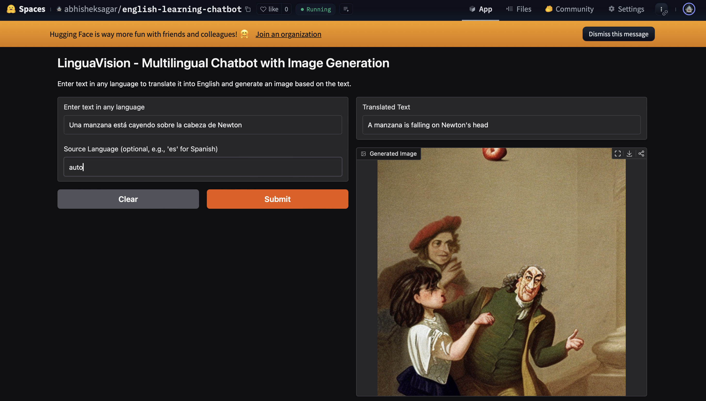

# Breaking Language Barriers: Engineering an AI-Powered Educational Translation and Visualization System

## Introduction

The intersection of neural machine translation and text-to-image synthesis presents unprecedented opportunities in computer-assisted language learning (CALL). This article introduces LinguaVision, a specialized educational tool that combines the MarianMT translation model with Stable Diffusion to create an intuitive language learning experience. By leveraging these advanced AI models through a streamlined Gradio interface, we demonstrate how modern deep learning can enhance second language acquisition through immediate visual feedback.

## Technical Architecture

### Core Components

The LinguaVision system is built on three fundamental pillars:

1. **Translation Engine**
   - **Model**: MarianMT (Helsinki-NLP/opus-mt-mul-en)
   - **Architecture**: Multilingual transformer-based neural machine translation
   - **Capabilities**: Handles translation from multiple source languages to English
   - **Notable Feature**: Auto-language detection support

2. **Image Generation System**
   - **Model**: Stable Diffusion v2.1 Base
   - **Implementation**: Direct integration with HuggingFace's diffusers library
   - **Hardware Adaptation**: Automatic CUDA/CPU detection with dtype optimization
   - **Output**: 512x512 pixel images with configurable generation parameters

3. **User Interface**
   - **Framework**: Gradio 
   - **Design**: Minimalist two-input, two-output interface
   - **Features**: Optional source language specification
   - **Processing Time**: ~12 minutes execution window

### System Workflow

The system operates through a three-stage pipeline:

1. **Input Processing**
   - Text input in any language
   - Optional source language specification (defaults to auto-detection)
   - Input sanitization and preprocessing

2. **Translation Processing**
   - Text tokenization using MarianTokenizer
   - Neural translation through MarianMT
   - Token decoding with special token removal

3. **Visual Synthesis**
   - Translation-to-prompt engineering
   - Image generation via Stable Diffusion
   - Local storage and display

## Educational Applications

### Pedagogical Benefits

1. **Immediate Visual Feedback**
   - Reinforces vocabulary through visual association
   - Provides cultural context through generated imagery
   - Supports visual learning styles

2. **Language Flexibility**
   - Supports multiple source languages
   - Automatic language detection reduces user friction
   - Consistent English output aids in standardized learning

3. **Accessibility**
   - Browser-based interface requires no installation
   - Sharable interface supports remote learning
   - Simple design reduces cognitive load

### Practical Implementation Example

Let's examine a complete learning interaction:

**Input Scenario**: Spanish to English Translation

**Input Scenario**: Spanish to English Translation

This interaction demonstrates how the system:
- Accurately translates idiomatic expressions
- Generates contextually appropriate imagery
- Reinforces vocabulary through visual association

## Performance Considerations

### Hardware Optimization

The system implements intelligent hardware detection:
- Utilizes CUDA acceleration when available
- Automatically falls back to CPU processing
- Optimizes memory usage through float16/float32 type selection

### Processing Timeline

Understanding the ~12-minute execution window:
- Translation: Near-instantaneous (1-2 seconds)
- Image Generation: Bulk of processing time (10-11 minutes)
- Interface Operations: Remaining overhead

## Ethical Considerations

### Data Privacy and Security

- No permanent storage of user inputs
- Local image generation and storage
- Transparent processing pipeline

### Educational Integrity

- Clear indication of AI-generated content
- Focus on learning assistance rather than replacement
- Maintenance of academic standards

## Future Development Directions

### Technical Enhancements

1. **Performance Optimization**
   - Batch processing for multiple translations
   - Cached image generation for common phrases
   - Response time reduction strategies

2. **Feature Expansion**
   - Integration of pronunciation guidance
   - Addition of contextual examples
   - Implementation of learning progress tracking

### Educational Features

1. **Interactive Learning**
   - Quiz generation from translations
   - Spaced repetition system integration
   - Personalized learning paths

## Conclusion

LinguaVision demonstrates the practical application of modern AI in language education. By combining neural machine translation with text-to-image synthesis in a user-friendly interface, it creates an engaging and effective learning environment. The system's modular architecture allows for future enhancements while maintaining its core educational value.

## References

Hugging Face. (2023). MarianMT Documentation. Retrieved from https://huggingface.co/docs/transformers/model_doc/marian

Rombach, R., et al. (2022). "High-Resolution Image Synthesis with Latent Diffusion Models." In *Proceedings of the IEEE/CVF Conference on Computer Vision and Pattern Recognition* (pp. 10684-10695).

Gradio Team. (2023). Gradio: Build Machine Learning Web Apps in Python. Retrieved from https://gradio.app/

